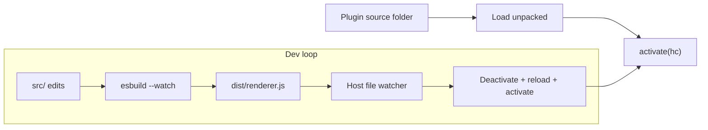

# Dev workflow

Use **unpacked** loading while you iterate on a plugin. HarborClient reads your project directory directly — the same layout as inside a `.hcp` file, with `manifest.json` at the folder root — instead of copying files into `userData/plugins/`.

Create a plugin project folder with `manifest.json` at the root (see [Manifest](/manifest)), then add a `package.json` like this to install the type definitions and bundle your renderer entry:

```json
{
  "name": "my-harborclient-plugin",
  "private": true,
  "type": "module",
  "devDependencies": {
    "@harborclient/sdk": "^0.2.0",
    "@types/react": "^19.0.0",
    "esbuild": "^0.25.0",
    "typescript": "^5.0.0"
  },
  "scripts": {
    "build": "esbuild src/renderer.tsx --bundle --outfile=dist/renderer.js --format=esm --jsx=automatic --jsx-import-source=@harborclient/sdk --external:react --external:react-dom",
    "dev": "esbuild src/renderer.tsx --bundle --outfile=dist/renderer.js --format=esm --jsx=automatic --jsx-import-source=@harborclient/sdk --external:react --external:react-dom --watch",
    "pack": "pnpm build && zip -r ../my-plugin.hcp manifest.json README.md assets dist"
  }
}
```

Run `pnpm install`, add `src/renderer.tsx` (exporting `activate(hc)` with `installReact(hc.react)`), then `pnpm build` or `pnpm dev` before loading the folder in HarborClient. Mark `react` and `react-dom` as **external** and use the JSX import source shown above. See [Building](/building) and [React and JSX](/renderer-overview#react-and-jsx).



## Load unpacked

Build your plugin at least once so `dist/` exists (`pnpm build` or `pnpm dev`), then register the project folder through [Settings → Plugins](https://harborclient.com/settings#plugins) (**Load unpacked…**) or via the startup options below. For UI plugins, open a contributed surface (for example your settings section) to trigger activation. Main-only plugins activate as soon as they are enabled.

HarborClient stores unpacked paths in a dev registry under `userData` and restores them on the next launch.

## Hot reload

When an unpacked plugin is enabled, the host watches:

- `manifest.json`
- Entry files referenced by the manifest (`renderer`, `main`, `stylesheet`, and similar)

When a watched file changes, HarborClient debounces briefly (so multi-file writes finish), then:

1. Calls `deactivate()` and disposes `hc.subscriptions`
2. Clears the cached entry module
3. Re-validates the manifest
4. Calls `activate(hc)` again

Leave the relevant Settings or UI panel open to see UI updates after each rebuild. If reload fails (syntax error, invalid manifest), the previous activation is torn down and an inline error is shown in [Settings → Plugins](https://harborclient.com/settings#plugins). Use **Reload** on the plugin row to force the same sequence manually.

## Recommended dev workflow

**Terminal 1** — watch-build the main entry:

```bash
cd request-logger
pnpm dev
```

**Terminal 2** — run HarborClient (from your app checkout or installed build):

```bash
pnpm dev
```

If your plugin also has a `main` entry, add a second esbuild target (or use `--watch` on both outputs) so HTTP hooks reload during development.

## Load unpacked at startup (optional)

For day-to-day work on the same plugin, you can register an unpacked path before launch:

| Mechanism            | Example                                                 |
| -------------------- | ------------------------------------------------------- |
| Environment variable | `HARBOR_PLUGINS_DEV=~/projects/request-logger pnpm dev` |
| CLI flag             | `harborclient --plugin-dev ~/projects/request-logger`   |

Multiple paths are separated by `:` on Linux and macOS, or `;` on Windows. Paths registered this way appear in [Settings → Plugins](https://harborclient.com/settings#plugins) the same as plugins loaded through **Load unpacked…**.

## Unpacked vs installed

|                   | Unpacked (development)        | Installed (`.hcp`)                  |
| ----------------- | ----------------------------- | ----------------------------------- |
| **Source**        | Your project directory        | Copy under `userData/plugins/<id>/` |
| **Updates**       | Rebuild `dist/`; host reloads | Install newer `.hcp`                |
| **Distribution**  | Not for end users             | Ship `.hcp` to users                |
| **Same manifest** | Yes                           | Yes                                 |

Installing a `.hcp` for the same `id` as an unpacked dev plugin replaces the dev registration with a normal installed copy.

## Host IPC (development)

These channels support the Settings UI and file watcher; plugin code does not call them directly:

| Channel                  | Purpose                                                                      |
| ------------------------ | ---------------------------------------------------------------------------- |
| `plugins:loadUnpacked`   | Register an absolute directory path                                          |
| `plugins:reload`         | Reload one plugin by `id`                                                    |
| `plugins:removeUnpacked` | Remove dev registration for `id`                                             |
| `plugins:list`           | Includes `source: 'installed' \| 'unpacked'` and `path` for unpacked entries |
